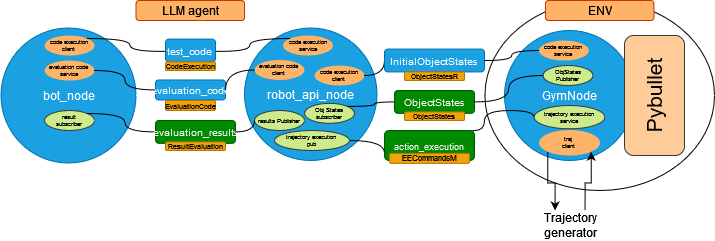

# OpenRobotGPT
Open source implementation of RobotGPT

# ROS2 structure:

The Ros nodes were created with the Idea of having 3 modular components.
- **LLM component**: This is where the call to a LLM model is done, based on the API described in the node robot_api_node. This node then convert the LLM request to tradition Action for the environment. This component can also be replaced by a traditional **RL agent**.
- **ENV component**: manage the connection with a LLM or RL agent, giving the possibility to ask for a certain action to be executed and receives the next_state associated with it. The actions are in the form of end effector final position-orientation-grip_status and how this positions are reached is managed by the trahectory_generator node. The physics env used as a basis is Pybullet.
- **Trajectroy generator**: component responsible for generating trajectory. One can decide to use moveit or other custom packages.

## How to run
Create an image from the dockerfile

```bash
docker build -t <image_name> .
```

Run the docker with gpus, ssh port enabled and x11 forwarding
```bash
docker run --gpus all -it --rm \
    -p 2222:22 \
    -e DISPLAY=$DISPLAY \
    -v /tmp/.X11-unix:/tmp/.X11-unix:rw \
    -v $(pwd)/workspace:/root/workspace:rw \
    <image_name>
```

(From another command line) Connect to the docker
```bash
ssh -X -p 2222 root@localhost
```

The password is "password"

Every time you need to reconnect to the container the SHA key will change. You can fix the error that pops up with this bash code
```bash
ssh-keygen -f "/home/nicola/.ssh/known_hosts" -R "[localhost]:2222"
```

In order to be able to connect from an Ubuntu machine use the following command
```bash
xhost +
```

# Testing of the pipeline:
The node to launch are in order:
- GymNode.
- the trajectory node (ex. MoveNodebasic, MoveIt).
- robot_api_node
- bot_node
